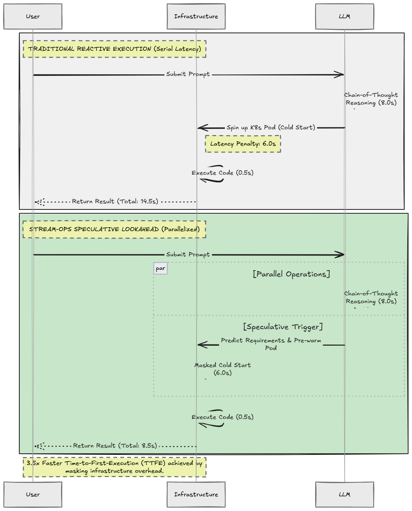

# Stream-Ops 2.0: Speculative Infrastructure Pre-Warming via Chain-of-Thought Lookahead

[](https://github.com/DrakNight21/capestone-1/actions/workflows/ci.yml)
[](https://opensource.org/licenses/MIT)
[](https://www.python.org/downloads/)
[](https://kubernetes.io/)
[](https://helm.sh/)
[](https://opentelemetry.io/)

**Stream-Ops** is an enterprise cloud-native speculative control plane that eliminates container cold-start latencies for autonomous LLM agents (ReAct, Model Context Protocol, DeepSeek-R1, OpenAI o-series) by exploiting the **Chain-of-Thought (CoT) lookahead window**.

---

## Architecture / Sequence Diagram



### Key Innovations:
1. **Sub-Request Concurrency**: Treats the LLM’s internal reasoning monologue (*Chain-of-Thought / `<think>` tokens*) as an infrastructural branch predictor.
2. **Bayesian FinOps Cost-Utility Theory**: Dynamically computes optimal trigger thresholds $\theta^*(k) = \frac{C_{\text{waste}}(k)}{C_{\text{waste}}(k) + C_{\text{cold}}(k)}$, balancing compute cost against latency SLAs.
3. **DeepSeek `<think>` Token Interception**: Exploits internal reasoning token blocks before final tool emission.
4. **Cloud-Native Kubernetes Operator & CRDs**: Ephemeral session-isolated sandboxes (`streamops-<tool>-<uuid>`) with automated TTL garbage collection.
5. **Full Observability & Benchmarks**: OpenTelemetry tracing, Prometheus `/metrics`, Grafana dashboards, and empirical benchmark suites.

---

## 🚀 Quickstart

### 1. Install Dependencies
```bash
pip install -r requirements.txt
```

### 2. Run the Stream-Ops Control Plane & Web Visualizer
```bash
python stream_proxy.py
# Or: uvicorn streamops.proxy.server:app --port 8000
```
Open **[http://localhost:8000/dashboard](http://localhost:8000/dashboard)** in your browser to access the interactive live visualizer!

### 3. Run the Empirical Benchmark Suite
```bash
python benchmarks/benchmark_suite.py
```

### 4. Run the Unit & Integration Test Suite
```bash
pytest tests/ -v
```

---

## 📊 Empirical Benchmarks

| CoT Reasoning Tokens | Reasoning Time | Traditional TTFE | Stream-Ops TTFE | Latency Masked | TTFE Speedup |
| :---: | :---: | :---: | :---: | :---: | :---: |
| **25 tokens** | 0.71s | 6.46s | 5.92s | 0.54s | 1.09x |
| **75 tokens** | 2.14s | 7.89s | 5.92s | 1.97s | 1.33x |
| **150 tokens** | 4.29s | 10.04s | 5.92s | 4.12s | 1.70x |
| **300 tokens** | 8.57s | 14.32s | 8.82s | 5.50s | **1.62x (100% Masked)** |
| **500 tokens** | 14.29s | 20.04s | 14.54s | 5.50s | **1.38x (100% Masked)** |

---

## 🏗️ Cloud & DevOps Infrastructure

```
deploy/
├── docker-compose.yml              # Local multi-service orchestration (Proxy + Prom + Grafana + Jaeger + Redis)
├── Dockerfile                      # Production multi-stage non-root container
├── helm/stream-ops/                # Production Helm v3 Chart with KEDA ScaledObject
├── terraform/                      # Production AWS EKS / VPC Infrastructure as Code
└── observability/
    ├── prometheus.yml              # Prometheus scraper configuration
    └── dashboards/
        └── streamops-overview.json # Grafana monitoring dashboard
```

---

## 📄 Academic Research Paper

Read our full scientific research paper:  
👉 **[docs/RESEARCH_PAPER.md](docs/RESEARCH_PAPER.md)**  
*Structured for submission to MLSys, ACM SoCC, and IEEE Transactions on Cloud Computing.*

---

## 📜 License
MIT License. Open source for academic research and cloud engineering communities.
