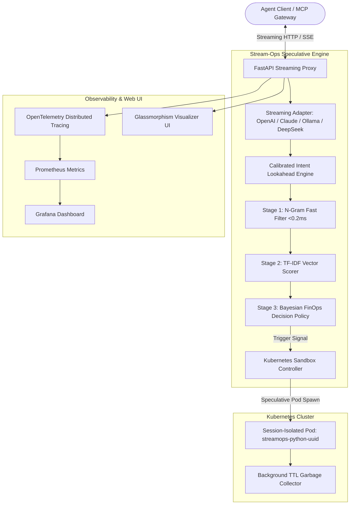

# System Architecture

Stream-Ops is engineered with a modular, cloud-native control plane architecture designed for high-throughput, low-latency LLM agent workloads.

---

## Architecture Components

### 1. Multi-Provider Streaming Adapters (`streamops/adapters/`)
Normalizes heterogeneous LLM streaming formats into a unified `StreamChunk` interface:
- **OpenAI SSE Delta Streams**: Parses `choices[0].delta.content` and `reasoning_content`.
- **Anthropic Claude Streams**: Normalizes `content_block_delta` and `thinking_delta`.
- **Ollama NDJSON Streams**: Parses newline-delimited JSON chunks.
- **DeepSeek R1 Interceptor**: Tracks `<think> ... </think>` token state machine.

### 2. Multi-Stage Intent Predictor (`streamops/intent/`)
- **Stage 1 (Sub-millisecond N-Gram Fast-Path)**: Evaluates compiled regex lookaheads in $<0.2\text{ms}$.
- **Stage 2 (TF-IDF Vector Scorer)**: Fits an n-gram vectorizer against dynamic tool catalogs and MCP specifications.
- **Stage 3 (Bayesian Threshold Gate)**: Validates against tool-specific cost-utility boundaries.

### 3. Kubernetes Sandbox Controller (`streamops/k8s/`)
- **Session Pod Naming**: Unique deterministic naming `streamops-<tool>-<session_id>` to guarantee concurrency isolation.
- **Two-Phase Commit**: Ephemeral pods start in `PREWARMED` state; transitioning to `CLAIMED` upon formal tool call execution.
- **TTL Garbage Collector**: Automatically reaps unclaimed pods after 60 seconds.
- **Offline Mock Fallback**: Seamless development experience with zero dependencies on a live cloud cluster.
